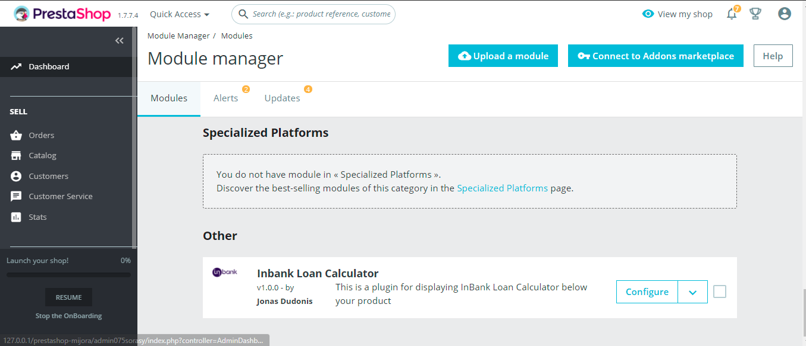
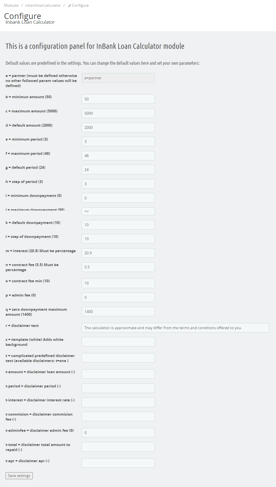

<h1 align="center">Inbank-Loan-Calculator-prestashop-module</h1>

This module is a plugin for displaying **InBank Loan Calculator** and is deployed onto each item when enabled.

### Compatibility
The module has been tested with the PrestaShop version:

1.7.4.4

and with PHP versions:

7.3

### Prerequisites
|  Follow links below to download: |
| ------------- |
| PrestaShop 1.7.7 (https://www.prestashop.com/en/download)      | 

### Installation

If you are deploying prestashop locally:
1. Clone the repository or dl .zip package
2. Use XAMPP, AMPPS or other open-source platform to launch a php interpreter.
3. Create a new schema 'prestashop4' in your MySQL database.
4. Open Prestashop on a local server.
```sh
http://127.0.0.1/prestashop-mijora/
```
5. Admin Panel access<br>
LOGIN: dudonis.j@gmail.com<br>
PASSWORD: Password
```sh
http://127.0.0.1/prestashop-mijora/admin075sorasy/
```
---
6. If you are deploying PrestaShop online, please follow the installation instructions in the link below:
http://doc.prestashop.com/display/PS17/Installing+PrestaShop

### **InBank Loan Calculator** view in *'Module Manager'*
<hr>

<hr>

### **InBank Loan Calculator** enabled in *item* page

<hr>

### Store front with Mijora slider 🚀

<hr>

## Authors
[Jonas Dudonis](https://github.com/JonasDudonis)
<br>
<a href="https://www.linkedin.com/in/jonasdudonis" target="_blank"></a> 